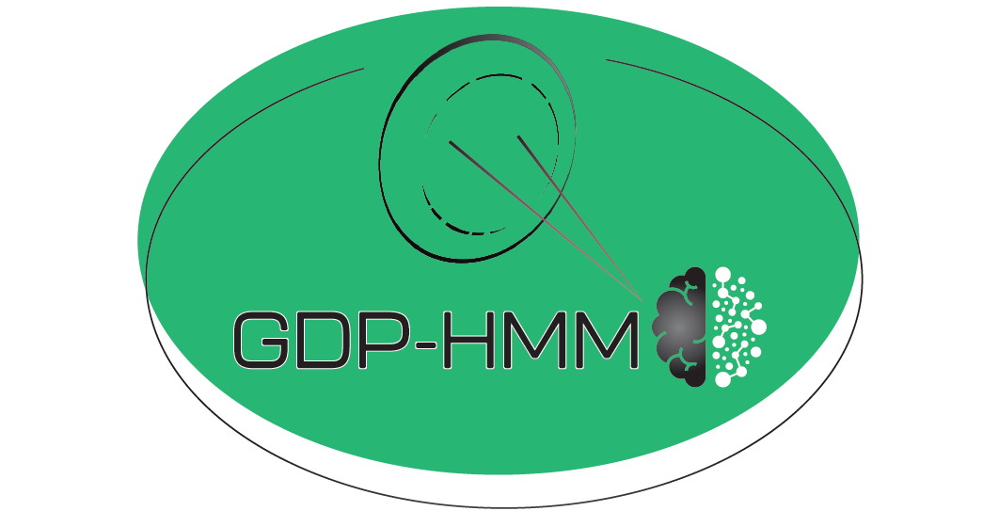
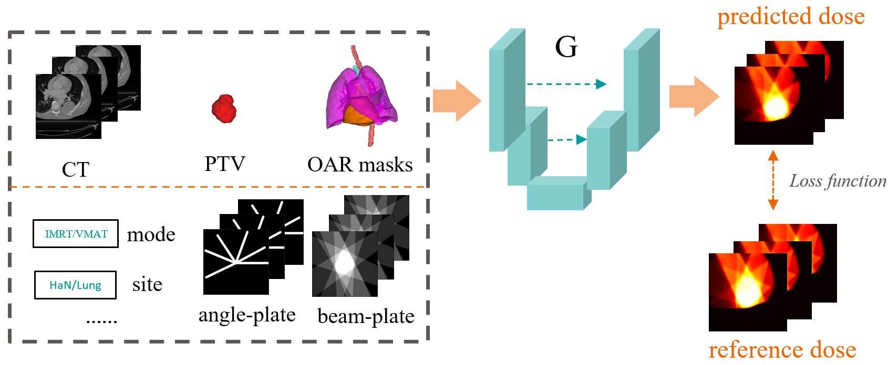
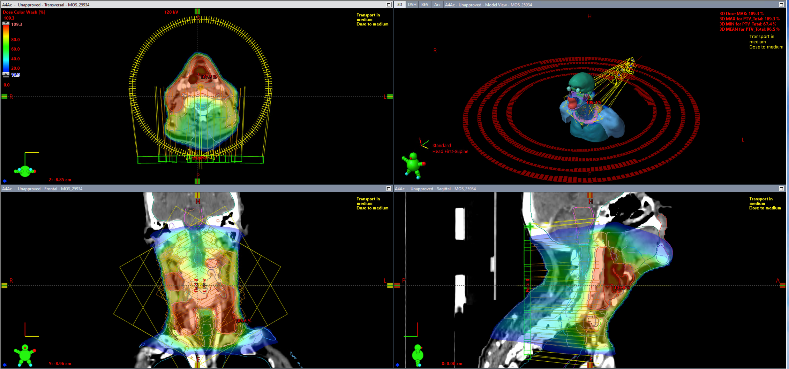
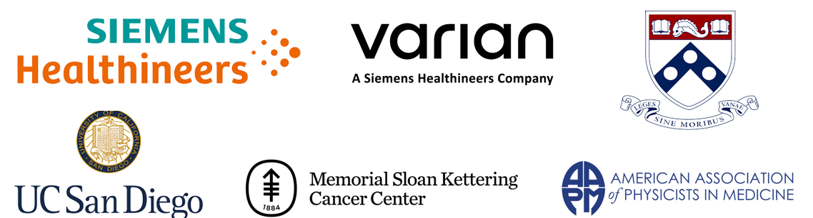

# GDP-HMM Challenge at AAPM 2025

<p align="center">
  
</p>

This repository provides code and tutorials designed to help participants get started with developing dose prediction models for the GDP-HMM Challenge at AAPM 2025. 

[<a href="https://www.aapm.org/GrandChallenge/GDP-HMM/" _target='blank'>AAPM website</a>] [<a href="https://qtim-challenges.southcentralus.cloudapp.azure.com/competitions/38/" _target='blank'>challenge platform</a>] [<a href="https://huggingface.co/datasets/Jungle15/GDP-HMM_Challenge" _target='blank'>Data (npz)</a>] [<a href="https://huggingface.co/datasets/Jungle15/Radiotherapy_HaN_Lung_AIRTP" _target='blank'>DICOM Data (optional for challenge)</a>] [<a href="https://huggingface.co/datasets/Jungle15/Radiotherapy_HaN_Lung_AIRTP" _target='blank'>Pre-Trained Baseline</a>] [<a href="https://arxiv.org/abs/2501.11803" _target='blank'>Arxiv</a>]

# Content 

- [Announcements and News](#Announcements-and-News)
- [What this repo does](#What-this-repo-does)
- [What this repo does NOT](#What-this-repo-does-not)
- [Important Timeline](#Important-Timeline)
- [Simplified Background](#Simplified-Background)
- [Data Understanding and Visualization](#Data-Understanding-and-Visualization)
- [Get Started and Training](#Get-Started-and-Training)
- [Evaluation Methods](#Evaluation-Methods)
- [Prizes and Publication Plan](#Prizes-and-Publication-Plan)
- [Challenge Organizers](#Challenge-organizers) 
- [Citation](#Citation) 

## Announcements and News 

:warning: **Attention!** The maximum allowed inference time for the deep learning module (excluding data preprocessing) is 3 seconds on a GPU with up to 24 GB of memory. To align with the challenge's objectives, participants must develop **a generalizable model** rather than creating separate models tailored to specific contexts. See detail explanation in [get_started_and_train.ipynb](get_started_and_train.ipynb) notebook. 

:rocket: [01/21/2025] Input data of <a href="https://huggingface.co/datasets/Jungle15/GDP-HMM_Challenge" _target='blank'>validation set</a> have been released; rings structures of previous train_XX.zip have been updated to match the validation set. 

 :rocket: [01/21/2025] <a href="https://huggingface.co/datasets/Jungle15/Radiotherapy_HaN_Lung_AIRTP" _target='blank'>DICOMs</a> of the data are released (not necessary for this challenge, but helpful for other research topics in radiotherapy).  

:rocket: [01/2025] Sanity check submission is open in challenge platform. See tutorial at [evaluation.ipynb](evaluation.ipynb) and Forum. 

:rocket: [01/2025] The challenge is officially started; training data and pretrained simple baseline are released; see links at [get_started_and_train.ipynb](get_started_and_train.ipynb)! 

:rocket: [12/2024] The challenge is announced to public; the GitHub repo and challenge platform are made public! 

## What this repo does

- *Simplified RT Background Tutorial*. We provide links of materials (most are written by organizers) introducing the (simplied) background of radiotherapy, dose prediction, and GDP-HMM challenge.  

- *Data Understanding and Visualization*. Jupyter notebook is available to guide participants in loading and visualizing the data step by step, with detailed explanations.

- *Data Preprocess*. We provide code of data preprocessing step by step with Jupyter notebook.  

- *Simple baseline*. We provide a simple baseline with the backbone of <a href="https://github.com/MIC-DKFZ/MedNeXt" _target='blank'>MedNeXt</a>. The ways of integrated condition to the network are motivated from [[2](#Citation)]. We include data loader, network, loss function, running command line, etc., to help participants get started. 

- *Evaluation Methods*. We provide code or/and details of evaluation metrics with Jupyter notebook. 

For any questions related to above, welcome to open issues. 

## What this repo does NOT

To ensure this repository remains focused on the challenge and to maintain fairness for all participants, we discourage opening issues related to the following topics: 

- *Urgent matters* - For time-sensitive issues like data access problems or data issues, email the lead organizer directly.

- *AI Engineering tricks* - We plan not to provide AI implementation suggestions for the challenge.

- *AI Technical paper questions* - We plan not to address AI methodology questions in the issues. but welcome any questions related to clinical background and data/task understanding.

For critical concerns, please email the lead organizer. Updates will be shared with all participants as needed.

## Important Timeline

- January, 2025: Phase I starts. Registration opens. Training dataset and GitHub are made available.
- February, 2025: Phase II starts. Validation datasets are made available. Participants can submit preliminary results and receive feedback on relative scoring for limited number of times.
- April 25, 2025: Phase III starts. Final test datasets are made available.
- May 13, 2025: Deadline for testing phase.  

## Simplified Background

Radiation therapy (RT) is a key cancer treatment used in about 50% of cancer cases. 3D dose prediction is vital in RT planning. References [[1,2](#Citation)] offer a good introduction and related works for the challenge background. An simplified introduction to RT and terminologies can be found in the Appendix A of [this paper](https://proceedings.mlr.press/v235/gao24g.html). Additionally, [the summary paper](https://aapm.onlinelibrary.wiley.com/doi/full/10.1002/mp.14845) from a previous related challenge OpenKBP can be helpful, though the context of this challenge is much more heterogenous. 

The input for this task includes CT images, PTVs/OARs masks, beam geometries, and more. The output is a 3D dose distribution generated from Eclipse (Varian’s treatment planning system), following the method described in [[1](#Citation)]. 



## Data Understanding and Visualization

An example of Eclipse visualization is shown below. For Jupyter visualization with NPZ files, please refer to [data_visual_understand.ipynb](data_visual_understand.ipynb). This notebook also introduces important numbers (e.g., prescribed doses for PTVs) and explains how to use them.



## Get Started and Training

We provide a training script with fewer than 40 effective lines of Python/PyTorch code and minimal package dependencies. Participants can quickly start with this and adjust the code to build more advanced models.  Our goal is to help user run the training code in **5 minutes**, and understand the code logic and parameters in **20 minutes**. 

Detailed instructions (e.g., challenge registration, data download, baseline) are available in [get_started_and_train.ipynb](get_started_and_train.ipynb).

## Evaluation Methods 

Two metrics are used for evaluation. The first is the mean absolute error, masked by the 5 Gy isodose lines and body mask. This metric aims to measure how close the prediction is to the reference under specific settings (e.g., beam geometries). The second metric is the quality index of the deliverable plan generated from the dose prediction, based on the scorecard described in Ref [[1](#Citation)].

Example code is provided in [evaluation.ipynb](evaluation.ipynb). 


## Prizes and Publication Plan

- **Monetary Awards:** Total $4,000 for top **N** teams (the number **N** will range from 5 to 10, depending on the number of teams participating in Phase III).
- **Certificate:** Top **N** teams will receive certificate endorsed organization team and AAPM.
- **Authorship:** Top **N** teams (up to two members per team) will be invited as co-authors on a journal manuscript summarizing the challenge. Additional team members will be acknowledged.
- **Presentations:** Top two teams will be awarded complimentary meeting registration to present their work.
- **Internship Opportunities**: Lead students of Top five teams will receive priority consideration for internships at Siemens Healthineers AI Center.


## Challenge Organizers 

- Riqiang Gao, Ph.D., lead organizer, (Siemens Healthineers)
- Florin Ghesu, Ph.D., (Siemens Healthineers)
- Wilko Verbakel, Ph.D., (Varian, a Simens Healthineers company)
- Rafe Mcbeth, Ph.D., (University of Pennsylvania)
- Sandra Meyers, Ph.D., (UC San Diego Health)
- Masoud Zarepisheh, Ph.D., (Memorial Sloan Kettering Cancer Center)
- Ali Kamen, Ph.D., (Siemens Healthineers)

Please contact Riqiang Gao with riqiang.gao@siemens-healthineers.com for further questions or collaborations. 

# Citation 

To acknowledge the work of challenge organization team and insights from previous publication, please kindly follow the  instructions below. 

- **Data citation**. If you find the data and challenge helpful for your research, please cite the following technique paper [1] that built the dataset (or/and the challenge summary paper when available). 

- **Baseline citation**. If you find the method and code for data preprocessing and data loading in the repo (e.g., creating the angle and beam plates) inspiring for your work, please cite [2]. If you use or adjust MedNeXt as your network structure, please cite [3]. 

In addtion to above, if any data and code resources in this repo is helpful for your research, please kindly cite [1] or/and [2]. Please kindly cite external linked resources accordingly if they helped you. 

```
[1] Riqiang Gao, Mamadou Diallo, Han Liu, Anthony Magliari, Wilko Verbakel, Sandra Meyers, Masoud Zarepisheh, Rafe Mcbeth, Simon Arberet, Martin Kraus, Florin Ghesu, Ali Kamen. Automating High Quality RT Planning at Scale. arXiv preprint arXiv:2501.11803. 2025.

[2] Riqiang Gao, Bin Lou, Zhoubing Xu, Dorin Comaniciu, and Ali Kamen. "Flexible-cm gan: Towards precise 3d dose prediction in radiotherapy." In Proceedings of the IEEE/CVF Conference on Computer Vision and Pattern Recognition, 2023.

[3] Saikat Ray, Gregor Koehler, Constantin Ulrich, Michael Baumgartner, Jens Petersen, Fabian Isensee, Paul F. Jaeger, and Klaus H. Maier-Hein. "Mednext: transformer-driven scaling of convnets for medical image segmentation." In International Conference on Medical Image Computing and Computer-Assisted Intervention, 2023.
```

# Disclaimer

The resources and information provided in this challenge are based on research results and for research purposes only. Future commercial availability cannot be guaranteed. 

#

