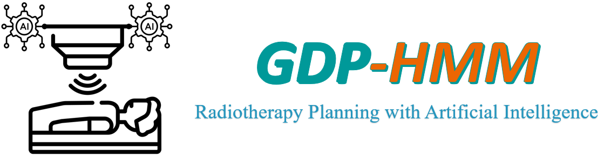

# GDP-HMM Challenge at AAPM 2025



The GDP-HMM repository provides code and tutorials designed to help participants get started with developing dose prediction models for the GDP-HMM Challenge at AAPM 2025. Additional information is available on the <a href="https://www.aapm.org/GrandChallenge/GDP-HMM/" _target='blank'>AAPM website</a> and the <a href="https://qtim-challenges.southcentralus.cloudapp.azure.com/competitions/38/" _target='blank'>challenge platform</a>.

# Content 

- [Announcements and News](#Announcements-and-News)
- [What this repo does](#What-this-repo-does)
- [What this repo does NOT](#What-this-repo-does-not)
- [Important Timeline](#Important-Timeline)
- [Simplified Background](#Simplified-Background)
- [Data Understanding and Visualization](#Data-Understanding-and-Visualization)
- [Get Started and Training](#Get-Started-and-Training)
- [Evaluation Methods](#Evaluation-Methods)
- [Prizes and Publication Plan](#Prizes-and-Publication-Plan)
- [Challenge Organizers](#Challenge-organizers) 
- [Citation](#Citation) 

## Announcements and News 

:warning: The maximum allowed inference time for the deep learning module (excluding data preprocessing) is 3 seconds on a GPU with up to 24 GB of memory. To align with the challenge's objectives, participants must develop a generalizable model rather than creating separate models tailored to specific contexts. See more explanation in [get_started_and_train.ipynb](get_started_and_train.ipynb) notebook. 

:rocket: [01/2025] The challenge will be officially started; training data will be released; more details will be supplied. 


## What this repo does

- *Simplified RT Background Tutorial*. We provide a simplified background and related articles [[1,2](#Citation)] for the challenge, designed to help participants—especially those with limited radiotherapy knowledge—quickly get started.

- *Data Understanding and Visualization*. Jupyter notebook is available to guide participants in loading and visualizing the data step by step, with detailed explanations. For additional information, please refer to the article.

- *Data Preprocess*. We provide code of data preprocess inspired by [[2](#Citation)], including the creation of angle plate and beam plate. 

- *Simple baseline*. We provide a simple baseline with the backbone of <a href="https://github.com/MIC-DKFZ/MedNeXt" _target='blank'>MedNeXt</a>. The ways of integrated condition to the network are motivated from [[2](#Citation)]. We include data loader, network, loss function, running command line, etc., to help participants get started. 

- *Evaluation Methods*. We provide the code or/and details of evaluation metrics. 

For any questions related to above, welcome to open issues or email the lead organizer. 


## What this repo does NOT

To ensure this repository remains focused on the challenge and to maintain fairness for all participants, we discourage opening issues related to the following topics. However, if you believe a topic is critically important, feel free to email the lead organizer. We may update our README.md file and notify participants as needed. The **not-eoncouraged issues of this repo** include 

- *Urgent Request*. We may not be able to monitor the issues in this repository very actively. If you need an urgent response, such as encountering broken data or issues accessing the data, please email the lead organizer directly. This will help us address the problem promptly for all participants.

- *AI engineering tricks*. We may not be able to provide suggestions on engineering tricks in this repository.

- *AI Technique Questions of Related Papers*. We may not be able to address AI technique questions related to papers in this repository. However, if your question pertains to the radiotherapy clinical background, feel free to reach out via an issue or email, and we will be happy to assist.

- *Job Positions in Siemens Healthineers*. We always welcome talent people to join us. However, please send an email rather than open an issue in this repo for questions in this category. 

## Important Timeline

- January, 2025: Phase I starts. Registration opens. Training dataset and GitHub are made available.
- February 15, 2025: Phase II starts. Validation datasets are made available. Participants can submit preliminary results and receive feedback on relative scoring for unlimited number of times.
- April 25, 2025: Phase III starts. Final test datasets are made available.
- May 13, 2025: Deadline for testing phase.  


## Simplified Background

Radiation therapy (RT) is a key cancer treatment used in about 50% of cancer cases. 3D dose prediction is vital in RT planning. References [[1,2](#Citation)] offer a good introduction and related works for the challenge background. An simplified introduction to RT and terminologies can be found in the Appendix A of [this paper](https://proceedings.mlr.press/v235/gao24g.html). Additionally, [the summary paper](https://aapm.onlinelibrary.wiley.com/doi/full/10.1002/mp.14845) from a previous related challenge OpenKBP can be helpful, though the context of this challenge is much more heterogenous. 

Gaining more knowledge about RT can be helpful, but participants can still perform well without an strong RT background, as we clearly define the input and output in this challenge. However, if your knowledge of AI and deep learning is limited, you may need to learn quickly to achieve the awards. :blush:. 

The input for this task includes CT images, PTVs/OARs masks, beam geometries, and more. The output is a 3D dose distribution generated from Eclipse (Varian’s treatment planning system), following the method described in [[1](#Citation)]. 


## Data Understanding and Visualization

An example of Eclipse visualization is shown below. For Jupyter visualization with NPZ files, please refer to [data_visual_understand.ipynb](data_visual_understand.ipynb). This notebook also introduces important numbers (e.g., prescribed doses for PTVs) and explains how to use them.


## Get Started and Training

We provide a training script with fewer than 40 effective lines of Python/PyTorch code and minimal package dependencies. Participants can quickly start with this and adjust the code to build more advanced models. Detailed instructions are available in [get_started_and_train.ipynb](get_started_and_train.ipynb). Our goal is to help user run the training code in **5 minutes**, and understand the code logic and parameters in **20 minutes**. 

## Evaluation Methods 

Two metrics are used for evaluation. The first is the mean absolute error, masked by the 5 Gy isodose line and body mask. This metric aims to measure how close the prediction is to the reference under specific settings (e.g., beam geometries). Example code is provided in [evaluation.ipynb](evaluation.ipynb). 

The second metric is the quality index of the deliverable plan generated from the dose prediction, based on the scorecard described in Ref [[1](#Citation)]. The calculation of this metric will be handled by the organizers, and participants only need to submit their results or solution package. A limited number of attempts are allowed to compute the quality index. The final ranking will be based on the average ranking of both metrics. 

## Prizes and Publication Plan

- **Monetary Awards:** A total $4,000 for top five teams (sponorship is pending for approval). 
- **Certificate:** Top five teams will receive certificate endorsed organization team and AAPM.
- **Authorship:** Top five teams (up to two members per team) will be invited as co-authors on a journal manuscript summarizing the challenge. Additional team members will be acknowledged.
- **Presentations:** Top two teams will present at the 2025 AAPM Annual Meeting.
- **Internship Opportunities**: Lead students of Top five teams will receive priority consideration for internships at Siemens Healthineers AI Center.


## Challenge Organizers 

- Riqiang Gao, Ph.D., lead organizer, (Siemens Healthineers)
- Florin Ghesu, Ph.D., (Siemens Healthineers)
- Wilko Verbakel, Ph.D., (Varian, a Simens Healthineers company)
- Rafe Mcbeth, Ph.D., (University of Pennsylvania)
- Sandra Meyers, Ph.D., (UC San Diego Health)
- Masoud Zarepisheh, Ph.D., (Memorial Sloan Kettering Cancer Center)
- Ali Kamen, Ph.D., (Siemens Healthineers)

Please contact Riqiang Gao with riqiang.gao@siemens-healthineers.com for further questions or collaborations. 

# Citation 

To acknowledge the work of challenge organization team and insights from previous publication, please kindly follow the  instructions below. 

- **Data citation**. If you find the data and challenge helpful for your research, please cite the following technique paper [1] that built the dataset (or/and the challenge summary paper when available). 

- **Baseline citation**. If you find the method and code for data preprocessing and data loading in the repo (e.g., creating the angle and beam plates) inspiring for your work, please cite [2]. If you use or adjust MedNeXt as your network structure, please cite [3]. 

In addtion to above, if any data and code resources in this repo is helpful for your research, please kindly cite [1] or/and [2]. Please kindly cite external linked resources accordingly if they helped you. 

```
[1] Riqiang Gao, Mamadou Diallo, Han Liu, Anthony Magliari, Wilko Verbakel, Sandra Meyers, Masoud Zarepisheh, Rafe Mcbeth, Simon Arberet, Martin Kraus, Florin Ghesu, Ali Kamen. Automating High Quality RT Planning at Scale. Technique Note, 2025 (to be public soon).

[2] Riqiang Gao, Bin Lou, Zhoubing Xu, Dorin Comaniciu, and Ali Kamen. "Flexible-cm gan: Towards precise 3d dose prediction in radiotherapy." In Proceedings of the IEEE/CVF Conference on Computer Vision and Pattern Recognition, 2023.

[3] Saikat Ray, Gregor Koehler, Constantin Ulrich, Michael Baumgartner, Jens Petersen, Fabian Isensee, Paul F. Jaeger, and Klaus H. Maier-Hein. "Mednext: transformer-driven scaling of convnets for medical image segmentation." In International Conference on Medical Image Computing and Computer-Assisted Intervention, 2023.
```

# Disclaimer

The resources and information provided in this challenge are based on research results and for research purposes only. Future commercial availability cannot be guaranteed. 

#

